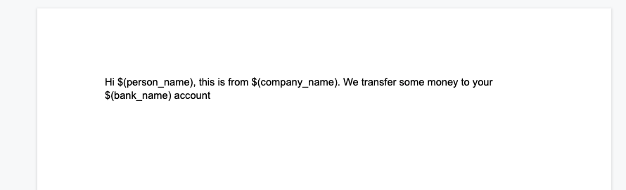
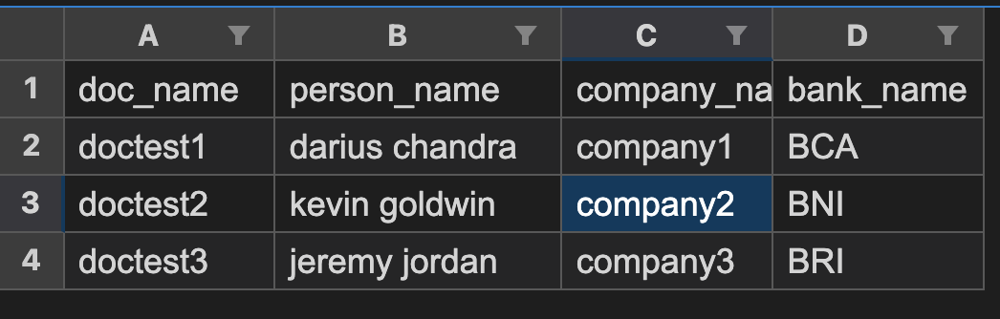
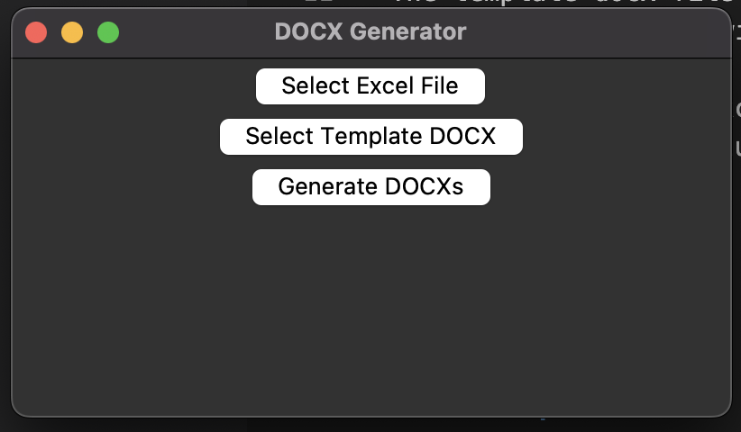

# DOCX Generator

This is a simple GUI desktop application that allows you to generate multiple docx files from an excel file and a docx template file. 

### How it works

The application takes 2 inputs, an excel file and a template docx file. The excel file contains the data that will be used to generate the new docx files and should have a column named 'doc_name' and other columns with the variables that will be replaced in the template docx file.




The template docx file is used as a base for the generated docx files and should contain placeholders in the format of $(variable_name) that will be replaced by the values from the excel file.

For each row in the excel file, the application generates a new docx file by replacing the placeholders in the template docx file with the values from the excel file and save the file with the name specified in the 'doc_name' column of the excel file.

## Getting Started

### Prerequisites

- Python 3.x
- pandas
- python-docx
- tkinter (if you want to use the GUI version)

### Installing

1. Clone or download the repository to your local machine
2. Install the required libraries using pip by running the command `pip install -r requirements.txt`
3. Run the script by running `python docx_generator.py`
4. Select the excel file and the template docx file using the GUI, then press the "Generate DOCXs" button.

### Executable

If you don't want to install python or the required libraries, you can download the executable file from [Releases](https://github.com/DariusChandra/docx-generator/releases) section of this repository.

### Using the app



1. Select the excel file that contains the data that you want to use to generate the docx files. The excel file should have a column named 'doc_name', and other columns with the variables that will be replaced in the template docx file.
2. Select the template docx file that you want to use as a base for the generated docx files. This file should contain placeholders in the format of $(variable_name) that will be replaced by the values from the excel file.
3. Press the "Generate DOCXs" button to generate the docx files. The generated files will be saved in the same directory as the script with the name specified in the 'doc_name' column of the excel file.

## Note
The script will check if there is docx file with the same name, the new output file will replace it.

## Built With
- Python
- pandas
- python-docx
- tkinter

## Build executable
You can use pyinstaller to generate executable file for various operating system
```bash
pyinstaller --onefile pdf_generator.py
```

## Author
Darius Chandra
